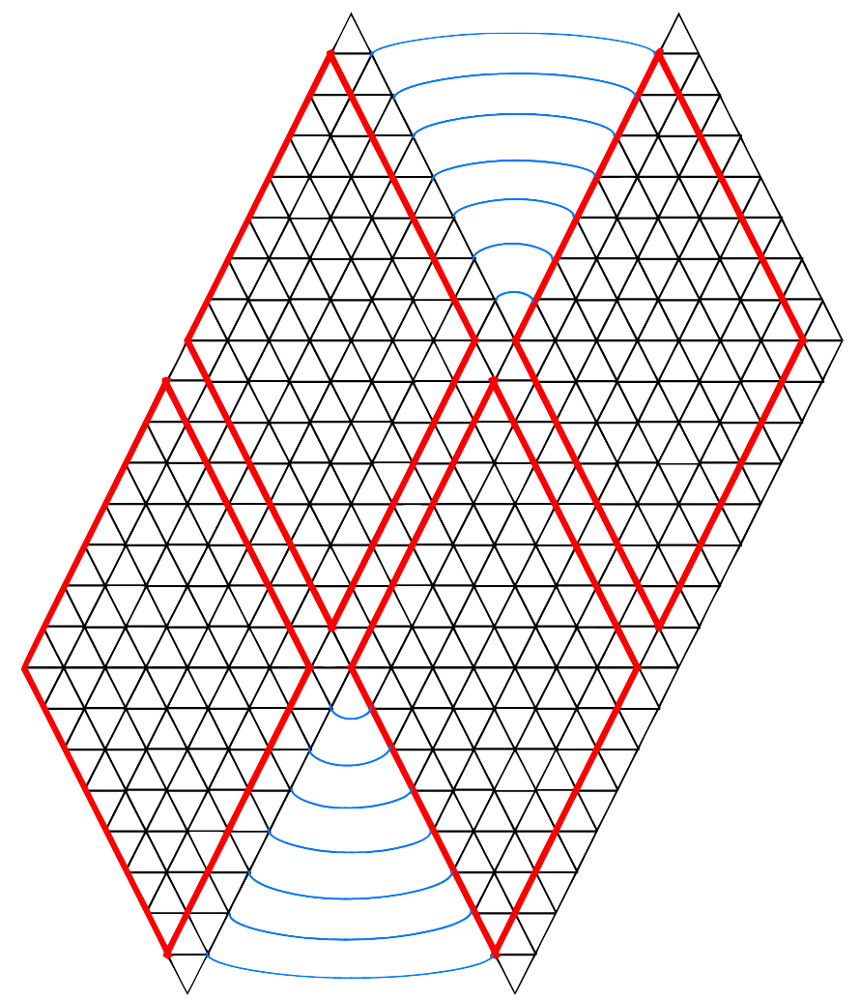

# Icosaheric Lattice

## About

The goal of this project is to solve the [Laplace Equation](https://en.wikipedia.org/wiki/Laplace%27s_equation), and in particular the [Heat Equation](https://en.wikipedia.org/wiki/Heat_equation) on an [Icosahedron](https://en.wikipedia.org/wiki/Icosahedron), which is a 20 sided polygon. The best way to think about this physically is that you have an icosahedron with a constant temperature on it's surface. You then have a point source (or multiple sources) of heat applied to the object. This project solves for what the heat distribution over the object would look like in equilibrium. We're using an icosahedron here because it is a good way to approximate a sphere, but also to use flat sides for easier computation. In theory, this model could be extended such that it would be more sphere-like by weighting the distances between points on the object differently.

This program is written such that it uses 10 processes, one for each "square" side of the icosahedron:

Each side "owns" it's upper-left and lower-left sides, with the exception of the top and bottom corners. In the program, the dimension of the side is given by `p.L`. Since the sides share a edges - for example, side 1 shares it's upper-right edge with side 3's upper-left edge - this dimension is the dimension of area which is owned by the process, so it is effectively 1 less than the true dimension of the side.

This layout covers the entire icosahedral, except for the very top and bottom tips (which are shared by sides `1, 3, 5, 7, and 9` and `0, 2, 4, 6, and 8` respectively.) These points are tracked in an additional space on sides 0 and 1. So in summary:

  - Side 0: Dimension is `(p.L x p.L) + 1`, where index `p.L x p.L` is the bottom tip.
  - Side 1: Dimension is `(p.L x p.L) + 1`, where index `p.L x p.L` is the top tip.
  - Sides 2-9: Dimension is `p.L x p.L`

The image below shows the ownership of the sides, and which points should be neighbors with each other.

The results are written out such that all sides of the icosahedral can be seen at once. Some examples of the plots created are shown below:

##### Heat point sources at the north and south poles

##### Heat point source at the north pole only

##### Heat point sources in the center of each side

## Compiling and Running

On a machine with MPI installed, compile the program by running:

    $ make

To run the program, run:

    $ mpirun -np 10 icosahedral_laplace [dimension]

The dimension parameter describes to dimension of each side of the icosahedral, and defaults to 8 if not provided.

To plot the results, you can start gnuplot

    $ gnuplot

Then at the prompt, run

    $ load 'plotter.p'
