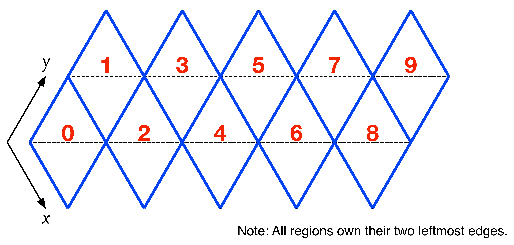
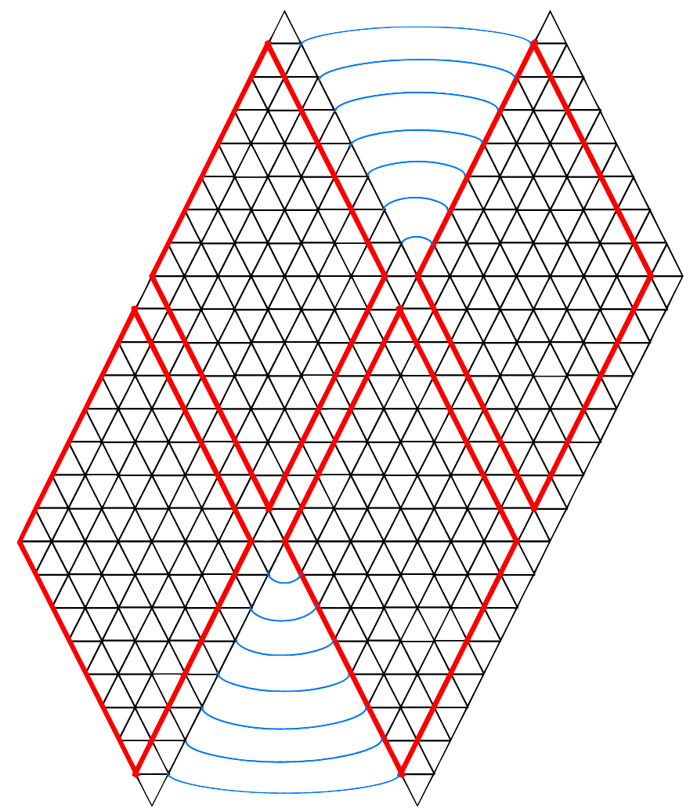
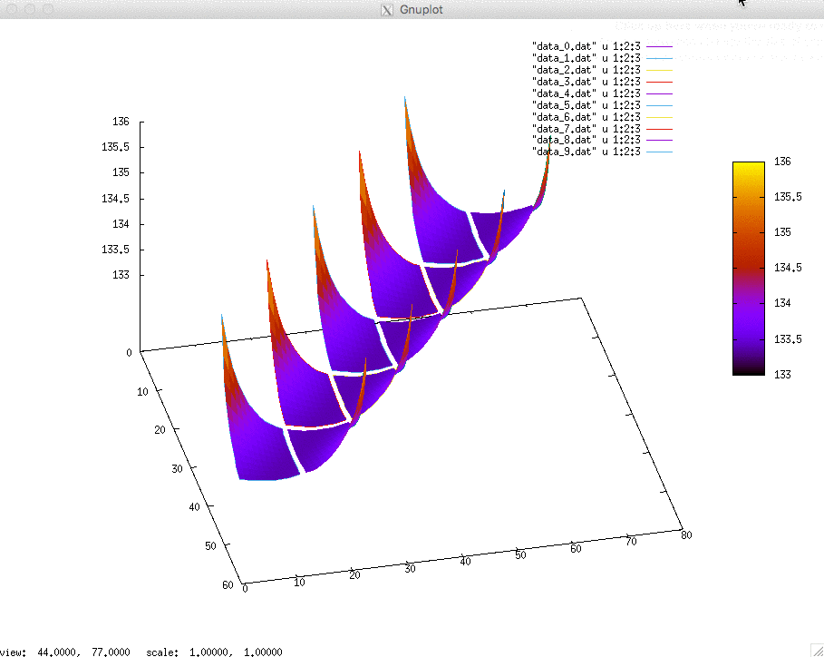
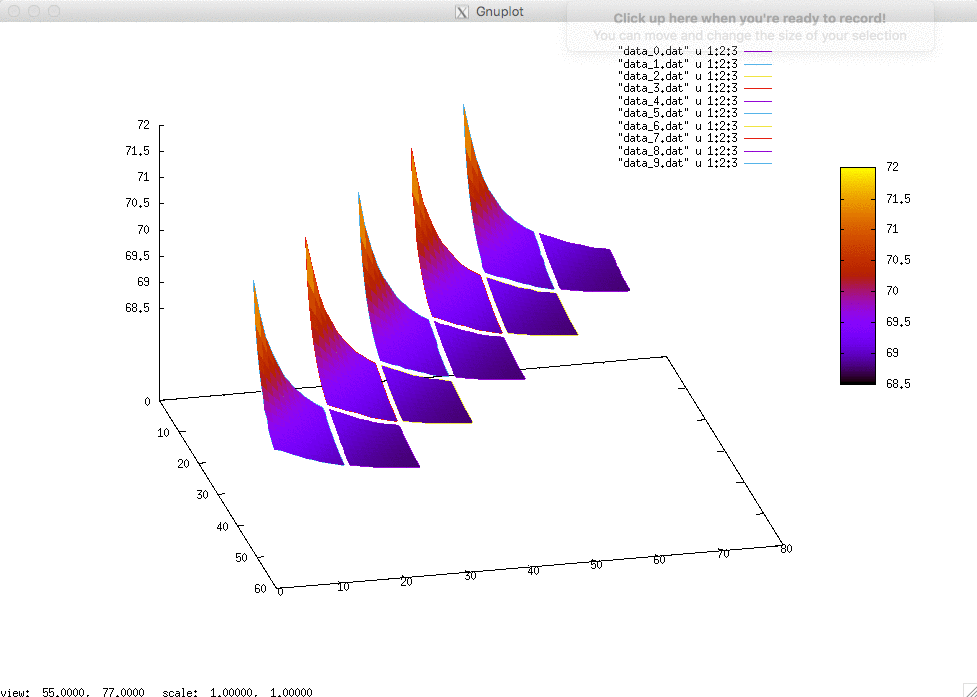
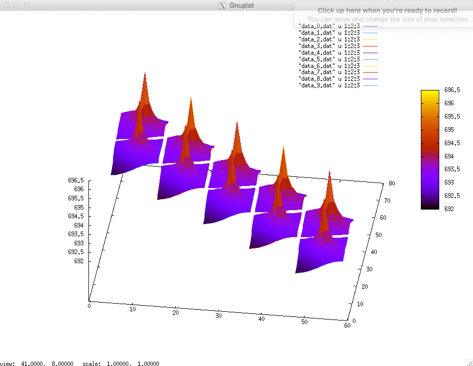

# Icosaheric Lattice

## Compiling and Running

On a machine with MPI installed, compile the program by running:

    $ make

To run the program, run:

    $ mpirun -np 10 icosahedral_laplace [dimension]

The dimension parameter describes to dimension of each side of the icosahedral, and defaults to 8 if not provided.

To plot the results, you can start gnuplot

    $ gnuplot

Then at the prompt, run

    $ load 'plotter.p'

## About

This program is written such that it uses 10 processes, one for each "square" side of the icosahedral:

Each side "owns" it's upper-left and lower-left sides, with the exception of the top and bottom corners. In the program, the dimension of the side is given by `p.L`. Since the sides share an edge - for example, side 1 shares it's upper-right edge with side 3's upper-left edge - this dimension is the dimension of area which is owned by the process, so it is effectively 1 less than the true dimension of the side.

This layout covers the entire icosahedral, except for the very top and bottom tips (which are shared by sides `1, 3, 5, 7, and 9` and `0, 2, 4, 6, and 8` respectively.) These points are tracked in an additional space on sides 0 and 1. So in summary:

  - Side 0: Dimension is `(p.L x p.L) + 1`, where index `p.L x p.L` is the bottom tip.
  - Side 1: Dimension is `(p.L x p.L) + 1`, where index `p.L x p.L` is the top tip.
  - Sides 2-9: Dimension is `p.L x p.L`

The image below shows the ownership of the sides, and which points should be neightbors with each other.

The results are written out such that all sides of the icosahedral can be seen at once. Some examples of the plots created are shown below:

